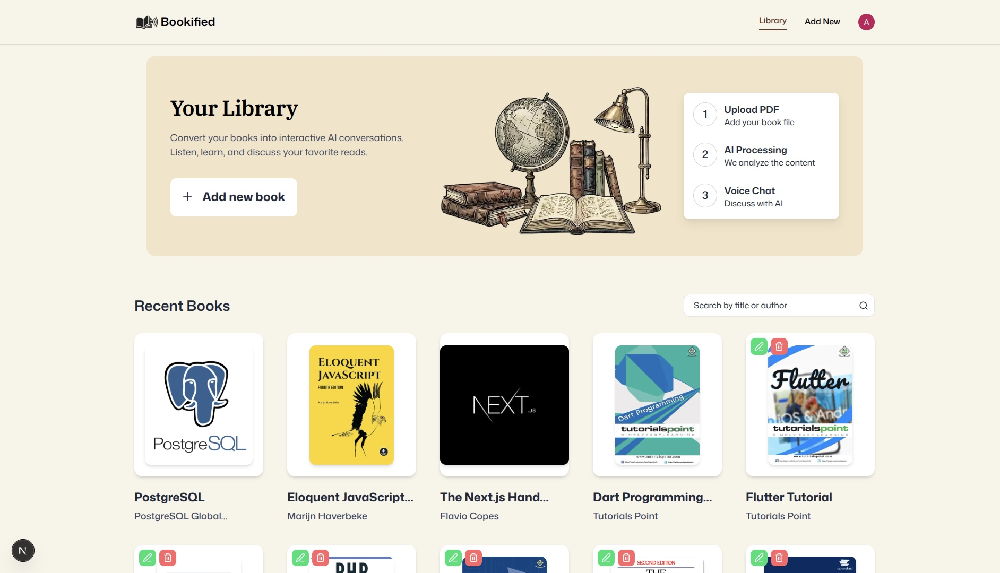
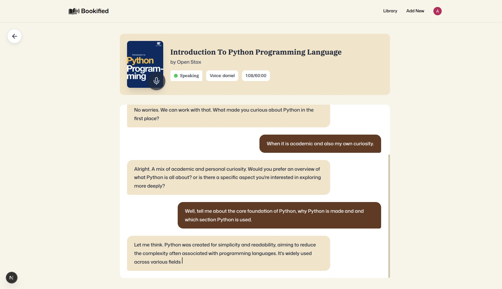

# Bookified 📚

<table align="center">
  <tr>
    <td align="center">
      
    </td>
    <td align="center">
      
    </td>
  </tr>
</table>

<p align="center">
  
  
  
  
</p>

<p align="center">
  
  
  
  
  
</p>

---

## Live Demo

Explore the project live here:  
🔗 https://bookified-xi.vercel.app/

---

## Description

**Bookified** is an AI-powered online library where users can upload books and interact with them through intelligent conversations.

Instead of just reading, users can **ask questions, explore ideas, and gain deeper insights directly from the book** using AI. The platform combines modern web technologies with conversational and voice AI to transform reading into an interactive experience.

---

## Tech Stack

### Frontend

- **Next.js**
- **React**
- **TypeScript**
- **TailwindCSS**

### Backend & Services

- **MongoDB** — Database
- **Clerk** — Authentication
- **Vercel Blob** — File storage for uploaded books
- **VAPI** — Voice AI interaction
- **ElevenLabs** — AI voice generation

---

## Get Started

Install dependencies:

```bash
npm install
```

Run the development server:

```bash
npm run dev
```

Open:

```
http://localhost:3000
```
